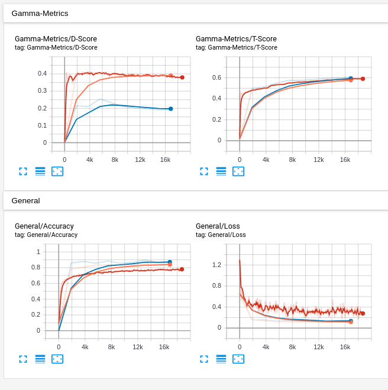
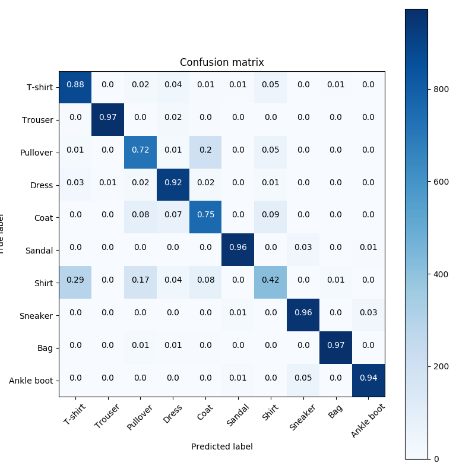
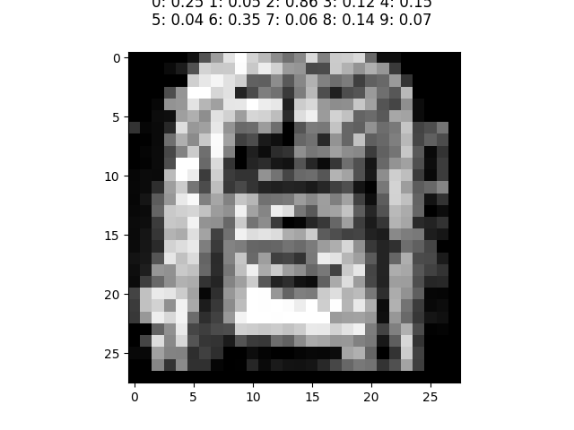

# Gamma capsule networks

Original TensorFlow 2.0 implementation of gamma capsule networks (https://arxiv.org/pdf/1812.09707.pdf).
If you find this code useful in your research, please cite:

    @misc{peer2019gammacapsules,
        title={Increasing the adversarial robustness and explainability of capsule networks with $\gamma$-capsules},
        author={David Peer and Sebastian Stabinger and Antonio Rodriguez-Sanchez},
        year={2018},
        eprint={1812.09707},
        archivePrefix={arXiv},
        primaryClass={cs.LG}
    }

*Note: In the paper we adapted the original implementation from [1] and compared with the 
implementations for routing-by-agreement (RBA) from [1] and [3] for matrix capsules. 
Both implementations where written in TensorFlow 1.x. Here we provide a reimplementation of 
gamma-capsules for TensorFlow 2.0 as it increases the readability. The results are 
similar then reported in the paper.*


# Setup
For this installation we assume that python3, pip3 and all nvidia drivers
(GPU support) are already installed. Then execute the following
to create a virtual environment and install all necessary packages:

1. Create virtual environment: ```python3 -m venv env```
2. Activate venv: ```source env/bin/activate```
3. Update your pip installation: ```pip3 install --upgrade pip```
4. Install all requirements. Use requirements-gpu if a gpu is available, requirements-cpu otherwise: ```pip3 install -r requirements.txt```

# Training
To train a gamma capsule networks execute the ```train.py``` script. It will train the network on fashionMNIST for 10 epochs using robust training with k=40, eps=0.1 and a = 0.01. During training the progress is shown on tensorboard for the accuracy, loss and all gamma-metrics:



As shown in the image also the D-score for [0-9] and [0] is recorded. Also activation maps for [0-9] and [0] and the confusion matrix on the test set is shown after each epoch. You can also compare the results with non-robust trianing if you set the gamma_robust argument to false. To debug the code set the enable_tf_function argument to false. As reported in [1] the shirt class is hard to learn:



If you want to compare it with classical capsule networks from [2] you can use the original implementation from [2]
or optionally you can also use the inofficial tf2 implementation that we provide in this repository ```capsule/capsule_layer.py```

*Note: In the paper we only used the original tf1 implementation to ensure that results are correct and not due to implementation bugs etc.*

# Activate capsule
To evaluate what each capsule represents call the ```activate_capsule.py``` script and set the layer argument 
(0 = hidden, 1 = output). The image that is generated together with its logits is then shown on tensorboard




# References
[1] - Increasing the adversarial robustness and explainability of capsule networks with $\gamma$-capsules <br />
[2] - Dynamic Routing Between Capsules <br />
[3] - Matrix capsules with EM routing <br />
[4] - Avoiding Implementation Pitfalls of “Matrix Capsules with EM Routing” by Hinton et al. <br />
[5] - Limitations of routing-by-agreement based capsule networks <br />
